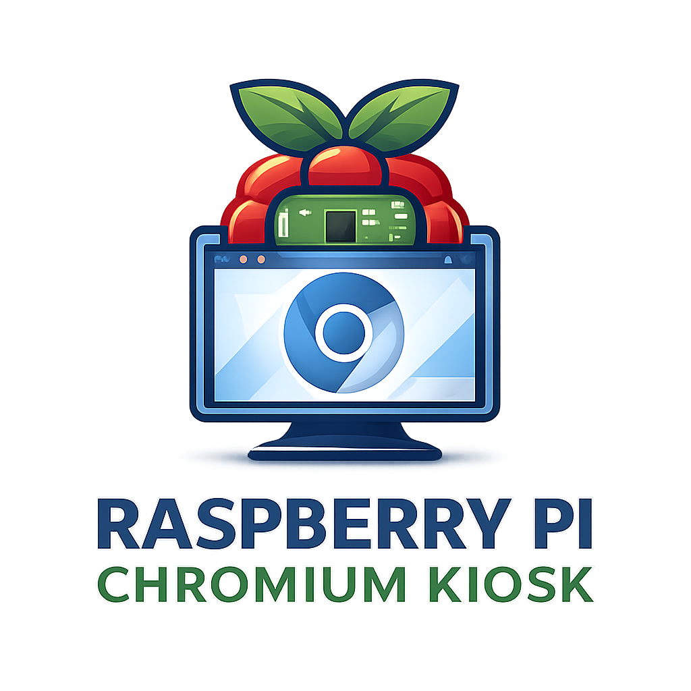

<h1 align="center">Raspberry Pi Chromium Kiosk</h1>

<p align="center">
   
   <br>
   <em>A Raspberry Pi kiosk that boots straight into Chromium kiosk mode,
      <br>with a web-based admin panel to change the kiosk URL remotely.</em>
   <br>
</p>

<p align="center">
   <a href="https://daniel-gia.github.io/raspberry-pi-chromium-kiosk/"><strong>Documentation</strong></a>
</p>

<p align="center">
   <a href="https://github.com/Daniel-Gia/raspberry-pi-chromium-kiosk/issues">Create an issue</a>
   <br>
   <br>
</p>

<p align="center">
   <a href="LICENSE">
      
   </a>
</p>

<hr>

A Raspberry Pi kiosk setup that boots straight into **Chromium in kiosk mode**, plus a **web-based admin panel** (accessible by IP in a browser from any device on the network) that lets you **change the kiosk URL remotely**.

## Setup (Raspberry Pi OS Lite)

> **Note:** Follow the full setup guide here:
> https://daniel-gia.github.io/raspberry-pi-chromium-kiosk/getting-started/

1. Install **Raspberry Pi OS Lite** (using the official Raspberry Pi imaging tool)
2. Install git:
   ```sh
   sudo apt install git
   ```
3. Clone the repository:
   ```sh
   sudo git clone https://github.com/Daniel-Gia/raspberry-pi-chromium-kiosk.git
   ```
4. Go to the setup folder:
   ```sh
   cd raspberry-pi-chromium-kiosk/setup
   ```
5. Make the setup script executable:
   ```sh
   sudo chmod +x setup.sh
   ```
6. Run the setup:
   ```sh
   sudo ./setup.sh
   ```
7. Generate admin panel login credentials:
   ```sh
   sudo ./generate-admin-login.sh {username} {password}
   ```
8. Reboot:
   ```sh
   sudo reboot
   ```

After reboot:
- The **kiosk browser** should start automatically on the Pi.
- The **admin panel** runs via Docker Compose (using host networking).

## How to changing the kiosk URL

- You can open the **admin panel from any device on the same network** by visiting the Pi’s IP address in a browser:
    - `http://<pi-ip>`
    - Example: `http://192.168.1.50`

## License

Licensed under the **Apache License 2.0 (Apache-2.0)**. See `LICENSE` and `NOTICE`.

## How to build the admin panel docker image
See `admin-panel/README.md`.

---

If this project helps you, please consider **starring the repo**.
Contributions (issues, fixes, docs improvements) are welcome.