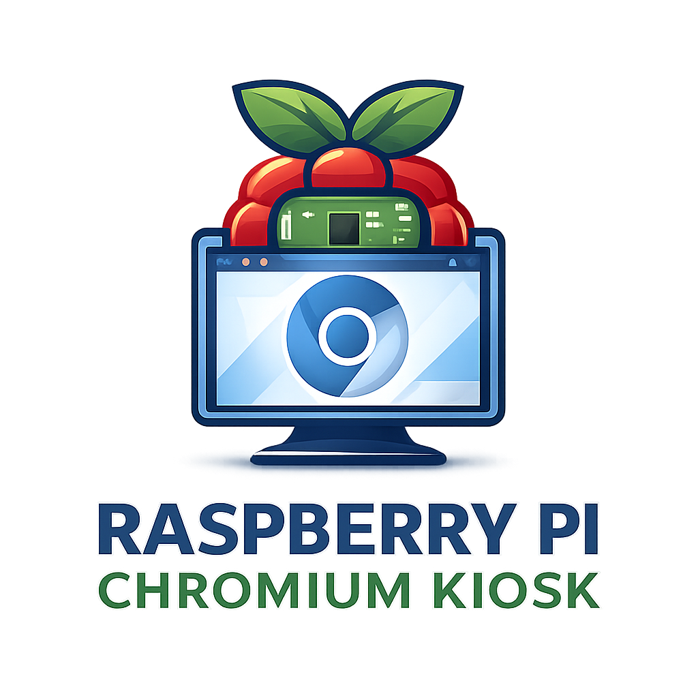

<h1 align="center">Raspberry Pi Chromium Kiosk</h1>

<p align="center">
   
   <br>
   <em>A Raspberry Pi kiosk that boots straight into Chromium kiosk mode,
      <br>with a web-based admin panel to change the kiosk URL remotely.</em>
   <br>
</p>

<p align="center">
   <a href="https://daniel-gia.github.io/raspberry-pi-chromium-kiosk/"><strong>Documentation</strong></a>
</p>

<p align="center">
   <a href="https://github.com/Daniel-Gia/raspberry-pi-chromium-kiosk/issues">Create an issue</a>
   <br>
   <br>
</p>

<p align="center">
   <a href="LICENSE">
      
   </a>
</p>

<hr>

A Raspberry Pi kiosk setup that boots straight into **Chromium in kiosk mode**, plus a **web-based admin panel** (accessible by IP in a browser from any device on the network) that lets you **change the kiosk URL remotely**.

## Setup (Raspberry Pi OS Lite)

> **Note:** Follow the full setup guide here:
> https://daniel-gia.github.io/raspberry-pi-chromium-kiosk/getting-started/

1. Install **Raspberry Pi OS Lite** (using the official Raspberry Pi imaging tool)

### Quick Install (Recommended)

Run this single command on your Raspberry Pi to install everything:

```sh
curl -sSL https://raw.githubusercontent.com/Daniel-Gia/raspberry-pi-chromium-kiosk/main/setup/install.sh | sudo bash -s -- <username> <password>
```

*Replace `<username>` and `<password>` with your desired admin panel credentials.*

Once finished, **reboot** your Pi:
```sh
sudo reboot
```

### Manual Install

If you prefer to clone the repo and run scripts manually, please see the [Manual Setup Guide](https://daniel-gia.github.io/raspberry-pi-chromium-kiosk/getting-started/).

After reboot:
- The **kiosk browser** should start automatically on the Pi.
- The **admin panel** runs via Docker Compose (using host networking).

## How to changing the kiosk URL

- You can open the **admin panel from any device on the same network** by visiting the Pi’s IP address in a browser:
    - `http://<pi-ip>`
    - Example: `http://192.168.1.50`

## How to contribute

- Start with reading [first steps](https://daniel-gia.github.io/raspberry-pi-chromium-kiosk/contribute/first-steps/)
- Setup the environment and make a fork - read [here](https://daniel-gia.github.io/raspberry-pi-chromium-kiosk/contribute/setup-environment/)
- Understand how to test changes on your pi locally - read [here](https://daniel-gia.github.io/raspberry-pi-chromium-kiosk/contribute/test-locally/)
- How to build the admin panel docker image (used in production) - See `admin-panel/README.md`.

## License

Licensed under the **Apache License 2.0 (Apache-2.0)**. See `LICENSE` and `NOTICE`.

---

If this project helps you, please consider **starring the repo**.
Contributions (issues, fixes, docs improvements) are welcome.